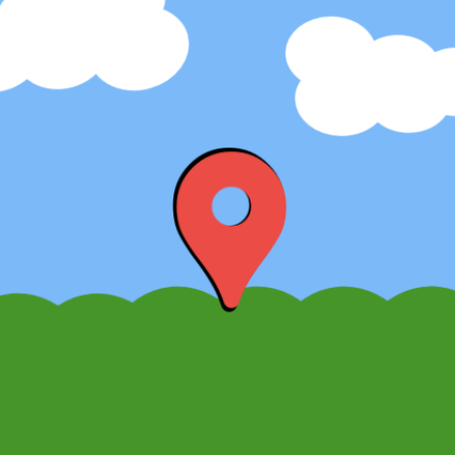

# GeoQuest 

**GeoQuest** is an Android application built with **Jetpack Compose**, **Firebase**, and the **Google Maps API** that allows users to create, view, and share locations on a shared interactive map.  

Users can save key locations with a name, description, and image, and choose whether to make them **public** (visible to everyone) or **private** (visible only to themselves).

All data is securely stored and synchronized using **Firebase Firestore**, user authentication is managed via **Google Sign-In** and using **Firebase Authentication**.

GeoQuest’s goal is to combine location tracking, social sharing, and gamified exploration into one engaging experience that helps users discover and connect with interesting places around them.

---

## ⚙️ Tech Stack

### 🧩 Frontend

- [Jetpack Compose](https://developer.android.com/jetpack/compose) – Modern declarative UI toolkit for Android
- [Kotlin](https://kotlinlang.org/) – Primary development language
- [Material Design 3](https://m3.material.io/) – Clean, modern UI components

### ☁️ Backend & Cloud

- [Firebase Firestore](https://firebase.google.com/docs/firestore) – NoSQL cloud database for data storage and synchronization
- [Firebase Authentication](https://firebase.google.com/docs/auth) – Secure Google Sign-In integration
- [Firebase Storage](https://firebase.google.com/docs/storage) – For image and media uploads
- [Google Maps API](https://developers.google.com/maps/documentation) – Map rendering and geolocation services
- [Node.js + Express (RESTful API)](https://expressjs.com/) – Server-side communication and data access

### 🧰 Tools

- [Android Studio](https://developer.android.com/studio) – Primary IDE
- [Retrofit](https://square.github.io/retrofit/) – HTTP client for REST API calls
- [GitHub](https://github.com/) – Version control and collaboration
- [ChatGPT](https://chatgpt.com) - Used for research and coding suggestions
- [Microsoft Copilot](https://copilot.microsoft.com) - Used to fix errors

---

## 🚀 Key Features

- 🗺️ Interactive map with live user location
- 📍 Add, edit, and delete custom locations
- 🌍 Public and private location visibility
- 🖼️ Upload and store images for locations
- 🧭 Gamification system (points, badges, achievements)
- 👥 Shared map for community exploration
- 🔐 Google Sign-In authentication
- ☁️ Cloud storage with real-time synchronization

---

## 🧑‍💻 Developer

**Connor Gray**
**Lead Programmer**  
_IIE Varsity College – BSc Computer Science (Application Development)_  
Cape Town, South Africa

**Taylor February**
_IIE Varsity College – BSc Computer Science (Application Development)_  
Cape Town, South Africa

**Sidney Jones**
_IIE Varsity College – BSc Computer Science (Application Development)_  
Cape Town, South Africa

---

## 🏁 License

This project is developed as part of the **PROG7314** module and is intended for academic use.

---

